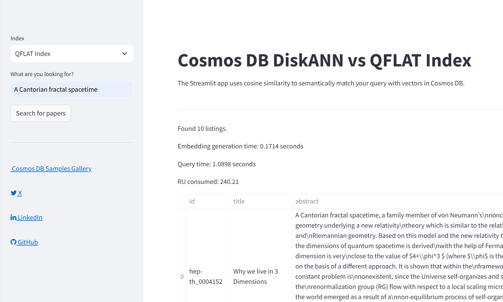

# Comparing DiskANN and Quantized Flat Indexes for Semantic Search in Azure Cosmos DB.

This repository contains a Streamlit application that allows users to search for research papers using semantic search powered by OpenAI embeddings and Azure Cosmos DB. The application uses cosine similarity to match user queries with research papers and displays the results.



## Features

- Semantic search for research paper abstracts using OpenAI embeddings.
- Integration with Azure Cosmos DB for storing and querying papers.
- Support for different vector indexing methods (No Index, Qflat Index, DiskANN Index).
- Interactive UI built with Streamlit.

## Prerequisites

- [Azure Cosmos DB](https://azure.microsoft.com/services/cosmos-db/) account with NoSQL API.
- [Azure OpenAI](https://azure.microsoft.com/products/ai-services/openai-service) account.

## Run the application locally

1. **Clone the repository**:
   ```sh
   git clone https://github.com/TheovanKraay/ignite-2024-diskann-demo.git
   ```

1. **Create file name ".env" in the "app" folder, and update with required environment variables for Azure Cosmos DB and Azure OpenAI**

   ```sh
   AZURE_OPENAI_APIKEY=
   AZURE_OPENAI_ENDPOINT=
   AZURE_COSMOSDB_ENDPOINT=
   AZURE_COSMOSDB_KEY=
   ```
   
1. **Install the required packages**:
   ```sh
   pip install -r requirements.txt
   ```
   
2. **Run the Streamlit application**:
   ```sh
    streamlit run src/app/cosmos-app.py
    ```

## Deploy the application to Azure with vscode

1. **Install the Azure App Service extension**:
   - Open the Extensions view by clicking on the square icon in the Sidebar.
   - Search for "Azure App Service" and click on the Install button.

2. **Deploy the application**:
   - create [Azure Web App](https://learn.microsoft.com/azure/app-service/overview) with Linux service plan (choose B1 SKU or higher), and Python 3.10.
   - In App Service go to configuration and paste `python -m streamlit run src/app/cosmos-app.py --server.port 8000 --server.address 0.0.0.0` in the `Startup Command` field.
   - Ctrl + Shift + P and select "Azure App Service: Deploy to Web App"
      1. Select this folder on your machine
      2. Select subscription
      3. Select the Azure Web App you created above.
   - Wait until app deployed (can take up to 5 minutes).

## Loading vectors into the containers

1. The app will create the containers with required vector policies and indexes -yYou need to load the data into the containers.
2. A sample databricks notebook is provided to load data into the containers from a file containing a json array of pre-vectorised documents: src/data/data-loader.ipynb

1. **Create a container in Azure Cosmos DB**:
   - Create a new container in your Azure Cosmos DB account with the following settings:
     - Database: `diskanndb`
     - Container ID: `papers`
     - Partition key: `/id`

   